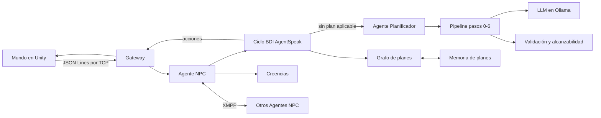

# NPC autónomos con BDI y LLM

[](https://github.com/JoseMoFi/Autonomous-LLM-NPC/actions/workflows/tests.yml)

Sistema multiagente para personajes no jugables (NPC) de un videojuego en Unity,
desarrollado como Trabajo Fin de Máster en la Universidad Internacional Menéndez
Pelayo.

Cada NPC es un agente BDI (creencias, objetivos e intenciones) cuyos planes se
escriben en AgentSpeak. A diferencia de un agente BDI clásico, su biblioteca de
planes no está cerrada: cuando no dispone de un plan aplicable, un **Agente
Planificador** sintetiza uno nuevo con un modelo de lenguaje (LLM). Ningún plan
generado se ejecuta sin antes pasar una verificación simbólica: un pipeline por
pasos, un validador contra el catálogo de acciones con reparación dirigida y un
simulador de alcanzabilidad. Los planes que funcionan se guardan en una memoria
persistente para reutilizarlos en sesiones posteriores, y los agentes pueden
delegarse objetivos entre sí mediante un protocolo de petición y aceptación.

## Arquitectura



- **Mundo (Unity)**: simulador y fuente de verdad. Ejecuta las acciones y envía
  la percepción a los agentes.
- **Agentes NPC** (`src/npc/`): un agente SPADE por personaje con su ciclo
  deliberativo, sus creencias y su grafo de planes.
- **Agente Planificador** (`src/llm/`): traduce objetivos en lenguaje natural a
  repertorios de variantes en AgentSpeak, verificados antes de devolverse.
- **Memoria de planes** (`src/utils/plan_memory.py`): repertorios persistentes
  con su registro de éxitos y fracasos.
- **Coordinación** (`src/protocol/peer_messages.py`): consultas de creencias y
  delegación de objetivos entre agentes sobre XMPP.

## Requisitos

- Windows 10 u 11.
- [Python 3.12](https://www.python.org/downloads/) (`spade-llm` requiere `>=3.11,<3.13`).
- [Ollama](https://ollama.com) con el modelo `qwen3:8b` (unos 5 GB). Se recomienda
  una GPU con al menos 8 GB de VRAM.
- Las builds de Unity, que se descargan desde la
  [última release](https://github.com/JoseMoFi/Autonomous-LLM-NPC/releases/latest).

## Puesta en marcha

1. Clona el repositorio y descarga el modelo:

   ```powershell
   git clone https://github.com/JoseMoFi/Autonomous-LLM-NPC.git
   cd Autonomous-LLM-NPC
   ollama pull qwen3:8b
   ```

2. Descarga `builds.zip` de la última release y descomprímelo en la raíz del
   repositorio, de modo que queden las carpetas `builds\single` y `builds\coop`.

3. Ejecuta una demo:

   ```powershell
   run_demo.cmd -List                  # demos disponibles
   run_demo.cmd -Demo A3               # un NPC fabrica pan
   run_demo.cmd -Demo CO6              # molinero y panadero se ayudan en ambos sentidos
   run_demo.cmd -Demo A3 -NoSubplans   # sin planes auxiliares escritos a mano
   ```

   La primera vez crea el entorno virtual e instala las dependencias. Después
   arranca el servidor en una ventana aparte y abre Unity. Mantén la ventana de
   Unity en primer plano, ya que la simulación se pausa al perder el foco. Al
   cerrar Unity se detiene también el servidor.

Cada sesión deja su traza completa en `logs/sessions/<fecha>/<hora>/trace.jsonl`,
incluidas todas las llamadas al modelo y las decisiones del pipeline.

## Demos

La carpeta [`demos/`](demos/) tiene al menos una demo por cada experimento de la
evaluación: las tareas con un agente (A1-A5), la cooperación (CO5 y CO6), la
memoria de planes y el arbitraje. Todas pueden ejecutarse con las configuraciones
SUB (por defecto), ATOM (`-NoSubplans`) y, las de dos NPC, DET (`-Deterministic`).
El detalle de cada una está en [`demos/README.md`](demos/README.md).

## Objetivos propios

Los objetivos se definen por NPC en un JSON con un enunciado en lenguaje natural
y su condición de éxito, que se comprueba contra las creencias del agente:

```json
{
  "npcs": [
    {
      "npc_id": "npc_001",
      "goals": [
        { "nl": "Collect 2 @wheat", "condition": "has_item(wheat, 2)" },
        { "nl": "Bake 1 @bread", "condition": "has_item(bread, 1)" }
      ]
    }
  ]
}
```

```powershell
run_demo.cmd -GoalsFile mis_objetivos.json -Build single
```

También puedes copiar cualquier fichero de `demos/` y cambiar sus objetivos y su
configuración.

En `builds\single` hay un NPC (`npc_001`) que puede recolectar trigo y fabricar
pan. En `builds\coop` hay dos: `npc_miller`, que solo sabe fabricar harina a
partir de trigo, y `npc_baker`, que solo sabe fabricar pan a partir de harina.

## Configuración

Los parámetros están en [`src/config/settings.json`](src/config/settings.json):
modelo (`llm_model`), URL de Ollama (`llm_base_url`), puertos, tiempos límite y
activación de la memoria, la coordinación y el arbitraje. Casi todos pueden
sobrescribirse con variables de entorno `NPC_*` (ver `src/config/__init__.py`).

Para claves de API u otros valores privados, crea
`src/config/settings.local.json`, que está excluido del control de versiones.

También puede arrancarse solo el servidor, para conectar un cliente de Unity
propio al puerto 7777:

```powershell
start_server.cmd
```

## Reproducir la evaluación

Los experimentos del artículo se lanzan con los scripts de `tools/`. Cada tanda
ejecuta las builds en segundo plano, intercala las configuraciones con el orden
contrabalanceado y analiza los resultados al terminar. Exigen que el árbol de git
esté limpio, para que cada sesión quede asociada a un commit.

```powershell
# Un agente: A1-A5 x SUB/ATOM x 16 repeticiones (160 sesiones)
powershell -ExecutionPolicy Bypass -File tools\run_suite_long.ps1 -Phase ablation

# Cooperación: CO5/CO6 x SUB/ATOM/DET x 6 repeticiones (36 sesiones)
powershell -ExecutionPolicy Bypass -File tools\run_suite_long.ps1 -Phase coop

# Memoria de planes: A4/A5 x SUB/ATOM, pares de sesiones sin y con memoria
powershell -ExecutionPolicy Bypass -File tools\run_suite_memory.ps1 -Runs 8
```

El diseño de los experimentos se describe en
[`docs/EVALUACION.md`](docs/EVALUACION.md), y los resultados obtenidos (informes
y CSV por sesión) están en [`results/`](results/).

| Experimentos | SUB | ATOM | DET |
|---|---|---|---|
| Un agente (A1-A5) | 80/80 | 68/80 | — |
| Cooperación (CO5-CO6) | 12/12 | 11/12 | 12/12 |

## Tests

```powershell
.venv\Scripts\python.exe -m pytest src/tests -q
```

No requieren Ollama, Unity ni red: el modelo y el mundo se sustituyen por dobles
de prueba, salvo en los tests de integración, que usan el motor BDI y el pipeline
reales con un modelo simulado.

## Estructura

| Ruta | Contenido |
|---|---|
| `src/main.py` | Arranque: XMPP embebido, gateway y registro de agentes |
| `src/gateway/` | Servidor TCP, enrutado de mensajes y registro de NPC |
| `src/npc/` | Agente NPC, creencias, ciclo BDI, coordinación y arbitraje |
| `src/llm/` | Agente Planificador, pipeline, prompts y validadores |
| `src/protocol/` | Mensajes Unity-Python, contratos de acción y protocolo entre agentes |
| `src/plans/` | Planes auxiliares en AgentSpeak y contratos de capacidades |
| `src/utils/` | Trazas y memoria de planes |
| `src/tests/` | Tests con pytest |
| `demos/` | Demos por experimento para `run_demo.cmd` |
| `tools/` | Lanzadores de sesiones y experimentos, analizadores y servidor MCP del mundo |
| `docs/` | Diseño de la evaluación |
| `results/` | Resultados de los experimentos |

## Cómo citar

Si usas este trabajo, cítalo con los datos de [`CITATION.cff`](CITATION.cff).

## Licencia

El código se distribuye bajo la licencia [MIT](LICENSE).
